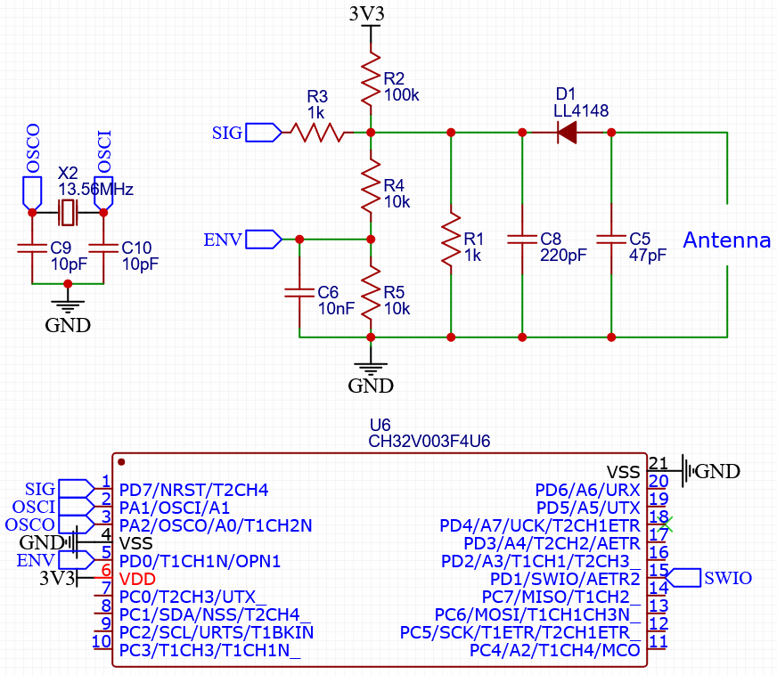

# CH32V003 NFC
Emulating a NFC tag directly on the CH32V003, inspired by [SimpleNFC](https://www.nonan.net/nkruse/simplenfc) using 
[ch32v003fun](https://github.com/cnlohr/ch32v003fun). This repository allows this 10-cent microcontroller to act as a ncf tag, requiring only a few passive components. The implementation here emulates a ISO/IEC 14443-3A, NFC Forum Type 2 Tag containg Ndef data. Though, any other tag supporting the 14443-3A standard should work as well. Currently supported commands reading and writing to the tag storate (including the UID), as well as the commands required for establishing communication.

The code in this repository relies on the built-in OPA in the CH32V003, including the corresponding pins D0, D4 and D7. Further TIM2 is needed for transmission through load modulation. Finally, a 13.56MHz oscillator provides the clock signal that matches the NFC signal. 

The current implementation is very basic, and does not handle anticollision and state changes according to specifications. Instead, this tag responds to every query it receives. Luckily, this is no problem when no other tags are present in front of the reader.

## Hardware

The antenna is a square planar coil of 36.83mm outer length, consisting of 6 turns of 0.254mm track spaced 0.254mm apart. This, with a capacitor `C5` of 47pF, has a resonance frequency of 13.56MHz. 

- `D1` Rectifies the incoming AC-signal
- `C8` and `R1` act as a low-pass filter, rejecting the 13.56MHz carrier.
- `C6`, `R5` and `R4` are a further low-pass filter that acts as a reference for the OPA to detect incoming pulses.
- `R3` is the input resistor, as well as the modulated load for transmission.
- `R2` weakly pulls up the signal to avoid false triggers.

`⚠️` The schematic above relies on the protection diodes in the IC. To better protect the microcontroller it may be advisable to add protection diodes.

## Applications
There is a lot that can be done over nfc, such as:
- Emulating a tag
- Reading sensors
- Controlling peripherals
- Programming the microcontroller
- So much more...